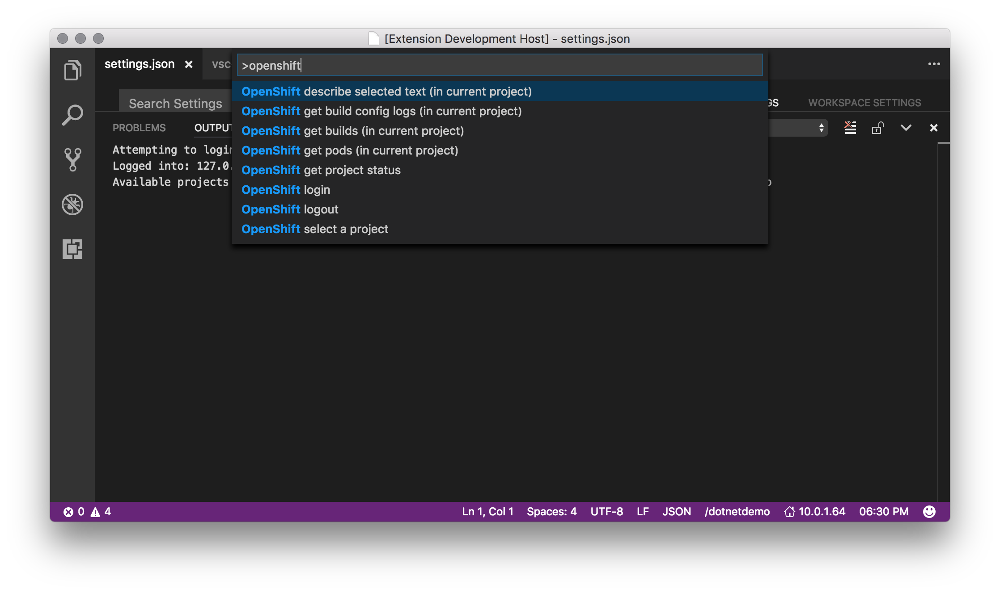
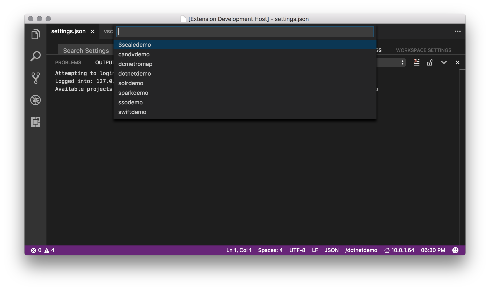

# OpenShift Extension for Visual Studio Code
## This is just a prototype extension, your contribution of ideas, design, code, and testing is welcome!

Connects Visual Studio Code to your OpenShift Container Platform (3.x) clusters to manage projects, deploy services, see status, and build apps.  

## Features

To bring up the capability press Cmd+Shift+P and type 'OpenShift'.  It'' bring up the list of available commands.

> Tip: Login is required before executing most of the other commands.



> Tip: Several commands require a selected project.  You can change by clicking the current project name in the status bar and then selecting a new project from the pick list.




## Requirements

Just network connectivity to your Open Shift cluster.  The app uses a REST over HTTPS.

## Extension Settings

Include if your extension adds any VS Code settings through the `contributes.configuration` extension point.

For example:

This extension contributes the following settings:

* `openshift.masterURL`: The URL of the master (defaults to `127.0.0.1:8443`)
* `openshift.token`: Bearer token for authentication to the API server
* `openshift.insecure`: Allow connections to cluster without approved SSL certs (defaults to true)
* `openshift.defaultProject`: The extenstion will try to select this project on login

You would add these to your UserSettings or WorkspaceSettings files.  For example:
```
{
    "openshift.token": "EJDKTFjsjkXxyP7lk_UouqS2PJdhtSY8p3rKDsuA_DU",
    "openshift.masterURL": "127.0.0.1:8443",
    "openshift.insecure": true,
    "openshift.defaultProject": "dotnetdemo"
}
```

## Known Issues

None.

## Release Notes

Just a prototype, no releases yet.

### Prerelease

Settings, Login, list builds, see pods...

-----------------------------------------------------------------------------------------------------------

**Enjoy!**